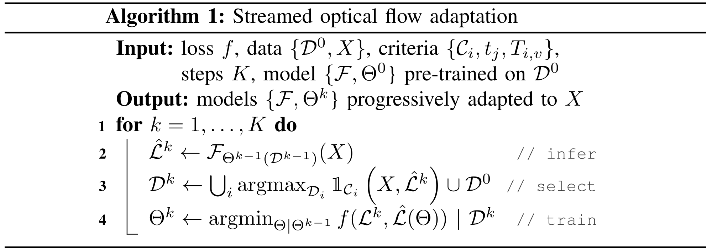

# sofa-flow: Streamed optical flow adaptation from synthetic to real dental scenes


> __Streamed optical flow adaptation from synthetic to real dental scenes__  
> [Emilia Lewandowska](https://mostwiedzy.pl/en/emilia-lewandowska,1103737-1), [Anna Jezierska](https://mostwiedzy.pl/en/anna-jezierska,447041-1), [Daniel Węsierski](https://mostwiedzy.pl/en/daniel-wesierski,444578-1)  
> _2025._  
> [Paper](https://)&nbsp;  


## Introduction


Optical flow is a key component of many video tasks including restoration, stabilization, and super-resolution. Recent advancements in optical flow are remarkable for general scenes but transfer imperfectly to challenging medical scenes that contain domain-specific visual events. 

Supervised learning is the dominant approach to reliable training of motion estimators but many medical video-assisted applications lack the needed ground truth. In particular, Video-Assisted Dentistry (VAD) requires video enhancements to augment dental workflows with continual vision allowing dentists see and reason better during dental treatments. 

To enable progress in VAD, this work proposes a new, large dataset of synthetic videos paired with ground truth optical flows and a streamed optical flow adaptation method. It progressively fine tunes optical flow neural networks in self-supervised manner from synthetic to real dynamic dental scenes with illumination changes, specular reflections, splashing fluids, and texture paucity. Leveraging new blind evaluation measures, we demonstrate a successful adaptation of state-of-the-art optical flow networks to challenging medical scenes in real video-assisted dental treatments.


## Datasets


### [Vident-synth](https://mostwiedzy.pl/pl/open-research-data/vident-synth-a-synthetic-intra-oral-video-dataset-for-optical-flow-estimation,104035052152797-0)

Vident-synth, a large dataset of synthetic dental videos with corresponding ground truth forward and backward optical flows and occlusion masks. It can be used for:
* evaluation of optical flow models in challenging dynamic scenes characterized by fast and complex motions, independently moving objects, variable illumination, specular reflections, fluid dynamics, sparse textures
* evaluation of blind measures for unsupervised learning
* development of long temporal models for optical flow estimation and dense point trackers
* training models in supervised and semi-supervised manner, including domain adaptation and transfer learning
* cross-domain learning

### [Vident-real](https://mostwiedzy.pl/pl/open-research-data/vident-real-an-intra-oral-video-dataset-for-multi-task-learning,104032256156938-0)

Vident-real, a large dataset of 100 video sequences of intra-oral scenes from real conservative dental treatments performed at the Medical University of Gdańsk, Poland. The dataset can be used for multi-task learning methods including:
* video enhancement
* video segmentation
* motion estimation
* video stabilization

Datasets can be downloaded from [Vident-synth](https://mostwiedzy.pl/pl/open-research-data/vident-synth-a-synthetic-intra-oral-video-dataset-for-optical-flow-estimation,104035052152797-0) and [Vident-real](https://mostwiedzy.pl/pl/open-research-data/vident-real-an-intra-oral-video-dataset-for-multi-task-learning,104032256156938-0).  

## Usage

We provide scripts and code to evaluate and generate datasets for Streamed optical flow adaptation. The data generated in this way has been used in streamed training, and the proposed frame selection method can be applied to train any optical flow model.

**Metrics implementation**: 
```shell
python3 infer_metrics.py
```

**Implementation of main class for metric computation and metric based optical flow selection**: 
```shell
python3 infer_seq.py
```

**Optical Flow Inference and data preparation for Streamed optical flow training**: 

This script performs optical flow estimation for image sequences using the RAFT or GMA model and saves the processed data. The code for the GMA and RAFT methods should be located in the `REPOS/GMA` and `REPOS/RAFT` folders, respectively. 

Pre-trained models should be placed in the `checkpoints` folder. You can download them from [checkpoints](). Ensure that the correct model weights are available before running the script.
```shell
# To run the script, use the following command:
python infer_flow.py --DEVICE cuda --MODEL checkpoints/RAFT_Sintel.pth --DATA_PATH /path/to/dataset --SPLIT test --IMAGE_DIR GT --SAVE_DATASET_DIR TMI_results

# Example usage
python infer_flow.py --DEVICE cuda --DATA_PATH /DATASETS/Vident-real-100 --SPLIT test --IMAGE_DIR GT --SAVE_DATASET_DIR output_results
```

How It Works
1. The script loads the model and input images (PNG files).
2. It computes the optical flow between consecutive frames.
3. The results are saved in the specified directory.
4. The script generates and saves metric plots based on the results.



The implemented code corresponds to the infer (line 2) and select (line 3) steps of the presented algorithm. Running the script `infer_flow.py` with the parameter `--DATA_PATH` will generate the dataset for the C1 variant and save the data in the `--SAVE_DATASET_PATH` folder. By default, the parameters are set to T=300 and t=1.0. The train step (line 4) of the algorithm, corresponding to step k, is executed using any model $ \mathcal{F} $, leveraging the original implementation of the model, such as RAFT. This allows for progressive adaptation of the model to the dataset. To perform streaming with our method, we need to select the path to the model from which the algorithm will be initialized, for example, `--MODEL = checkpoints/RAFT_Sintel.pth`, then choose the data source with `--DATA_PATH = '/DATASETS/Vident-real-100'`, specify the dataset split using `--SPLIT` train, and indicate the subfolder containing the images with `--IMAGE_DIR = 'GT'`. Additionally, we need to provide the name of the folder where the data for the next training step of the algorithm will be saved using `--SAVE_DATASET_PATH`.

As a result, we obtain data that is used to fine-tune the model for step k+1. Then, following the same method described above, we generate the dataset for training step k+2 using the model from step k+1. This iterative process continues, progressively adapting the model to the data in a streamed manner.


# License
MIT License. See [LICENSE](LICENSE) file. 

# Acknowledgement
In our implementation, we used the evaluation metrics from the [UnFlow](https://github.com/simonmeister/UnFlow). Additionally, our streaming method utilizes  [GMA](https://github.com/zacjiang/GMA) and [RAFT](https://github.com/princeton-vl/RAFT) models. We would like to thank the authors for their valuable contributions to optical flow research and for making their implementations publicly available.


